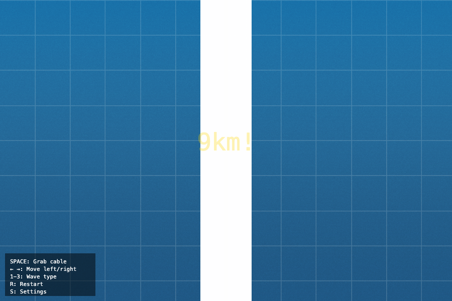

# Space Monkey Elevator 🚀🐵

**Play it:** [atominnovationth.github.io/SMX](https://atominnovationth.github.io/SMX/)

**Space Monkey Elevator — a contactless space-elevator-climber simulation, reaching the Kármán line.**

<!-- TODO: replace with a 10–15s gameplay GIF when one is available -->


You play an up-climber riding a graphene space-elevator seed tether from sea level to the Kármán Line (100 km). A ground station beams **longitudinal (compression) waves** up the tether, and the monkey's hands are **electro-permanent magnets (EPMs)** that *pulse* to couple to them — no physical contact. Tap `SPACE` in time with the wave's peak velocity to gain upward momentum while regeneratively powering your magnets.

---

## How it works (the concept)

> A ground station beams longitudinal (compression) waves up a conductive graphene/CNT space-elevator seed tether. An up-climber rides them contactlessly: its electro-permanent-magnet hands pulse to induce eddy currents in the moving tether, coupling at peak wave velocity to gain upward momentum while regeneratively skimming &lt;10% of that energy to power the magnets. It carries cargo (tether material) toward the Kármán Line. Waves fade with altitude, so a stronger tether material reaches higher. Down-climbers — which would brake regeneratively on descent and reinforce the tether — are the next chapter.

The cute monkey is intentional: it keeps people open-minded about a genuinely novel propulsion concept. The playable climb stops at the **Kármán Line (100 km)**; in reality the seed tether continues to **geostationary orbit (35,786 km)** and a counterweight beyond, where effective gravity flips outward — that part is shown as context on the finish screen, not simulated.

### Whose idea this is

The concept is **not ours**. This game is a delivery vehicle for published work:

- **Blaise Gassend**, *Powering Climbers Using Mechanical Waves*, ISDC 2025 — the primary source ([slides](https://gassend.net/spaceelevator/isdc2025/), [ISEC mirror](https://www.isec.org/s/ISDC2025-05-Powering-Climbers-Using-Mechanical-Waves.pdf)).
- **Mark A. Wessels**, *Space Elevator Propulsion with Mechanical Waves*, [arXiv:1802.07443](https://arxiv.org/abs/1802.07443) (2018); patent US 8,196,867 B1.
- **Keith Lofstrom**, *Acoustic Wave Powered Climbers* ([related wiki](http://www.launchloop.com/AcousticClimber)).
- **Zubax Robotics [FluxGrip FG40](https://fluxgrip.zubax.com/)** — the real electro-permanent-magnet hardware the coupling stack is modelled on. No affiliation or endorsement implied.

Full citations, and which numbers are published versus estimated, are in [`ATTRIBUTIONS.md`](ATTRIBUTIONS.md).

---

## Quick start

Three ways to play:

1. **Clone and open** — zero dependencies, any modern browser:
   ```bash
   git clone https://github.com/AtomInnovationTH/SMX.git
   cd SMX
   open index.html
   ```
   `index.html` loads the landmark sprites from the `assets/` folder (present in the clone). If your browser blocks those local files under `file://`, use the local dev server below.
2. **Local dev server** — serve the folder and open the same build artifact GitHub Pages serves:
   ```bash
   python3 -m http.server 8000
   # then open http://localhost:8000/index.html
   ```
   To preview edits to the source before rebuilding, open `http://localhost:8000/Space_Monkey_Elevator.html` at the same server.
3. **GitHub Pages** — open the live demo link at the top of this README (once Pages is enabled on your fork).

---

## Controls

| Key | Action |
|---|---|
| `Space` | Pulse your EPM hands to couple to the wave (hold to keep pulsing; time it to the wave's peak velocity) |
| `R` | Restart run |
| `S` | Toggle settings panel |
| `C` | Toggle Okabe-Ito colorblind palette |
| `M` | Toggle sound (starts muted) |
| `Esc` / `P` | Pause / resume |
| `1` / `2` / `3` | Switch wave type — sine / square / sawtooth |
| ⚙ button (top-right) | Open settings panel (same as `S`) |

---

## Features

- **Milestone shake + particles** triggered when the player crosses a milestone altitude
- **Named landmarks** along the climb — Burj Khalifa → Mt. Everest → Kármán Line → ISS Orbit
- **Ghost-line PB tracker** — best altitude persisted in `localStorage` and drawn as a horizontal target line
- **Coyote time + input buffering** (`COYOTE_MS` / `BUFFER_MS` in [`Space_Monkey_Elevator.html`](Space_Monkey_Elevator.html)) so near-miss pulses still feel fair
- **One-button restart** (`R`) with a clear game-over state
- **`prefers-reduced-motion`** honored — camera shake and particle bursts are suppressed automatically
- **Okabe-Ito colorblind palette** toggle (`C`) — coupling quality is no longer colour-only

---

## Building from source

The repo ships two HTML files at the root:

- [`Space_Monkey_Elevator.html`](Space_Monkey_Elevator.html) — **editable source of truth**. References assets in [`assets/`](assets).
- [`index.html`](index.html) — **committed build artifact**, auto-generated (do not hand-edit). The statically-referenced assets (clouds, the monkey SVG, noise textures) are inlined as base64 data URIs. The 78 landmark sprites are referenced through a runtime-built path, so they are **not** inlined and still load from [`assets/`](assets). `index.html` must therefore be served **alongside** that folder (as it is on GitHub Pages); it is not a standalone offline single file.

To rebuild after editing the source:

```bash
python3 embed_assets.py
```

This regenerates [`index.html`](index.html) by inlining the statically-referenced assets from [`Space_Monkey_Elevator.html`](Space_Monkey_Elevator.html). The landmark sprites are skipped (their path is built at runtime) and continue to load from [`assets/`](assets). Commit **both** files together.

---

## Project structure

```
.
├── index.html                   # the game (served by Pages, alongside the assets folder)
├── assets/                      # runtime assets (.webp, .svg) — landmark sprites load from here
├── Space_Monkey_Elevator.html   # editable source (this is what you edit)
├── embed_assets.py              # build script: source → index.html
├── tests/                       # zero-dependency Node unit tests (node --test)
├── screenshots/                 # README / social imagery
├── docs/                        # DEVELOPERS, CHANGELOG, setup guide, archived planning docs
├── .github/                     # CI workflow, issue/PR templates, CONTRIBUTING, CODE_OF_CONDUCT
├── LICENSE                      # MIT
└── README.md                    # you are here
```

---

## Credits

- Original concept: Space Monkey climbing game.
- Technologies: vanilla JavaScript, Canvas 2D, WebGL atmosphere shader.
- Inspiration: ["Space Elevator" by Neal Agarwal](https://neal.fun/space-elevator/). The *concept* — climbing past real-world landmarks toward the Kármán Line — is a tribute to that page. All code and artwork in this repo are original (see [`ATTRIBUTIONS.md`](ATTRIBUTIONS.md)). On the specific question of neal.fun's source, what this repository can prove: no `.js`, `.css` or GLSL from neal.fun was ever tracked here, and all 10 WebGL sky textures are original procedural work generated in-repo (no texture image files exist). The sky's *layer structure* parallels the reference page, and the GLSL has not been line-by-line audited against it — [`ATTRIBUTIONS.md`](ATTRIBUTIONS.md) discloses the details rather than asserting more than the evidence shows. The original *Space Elevator* concept and its artwork remain **© Neal Agarwal**. (Game mechanics and concepts are not themselves copyrightable; Neal's specific assets are — and none are used here.)

> ✅ **Artwork status — resolved at v1.0 (2026-08-03).** All imagery in [`assets/`](assets) is original to this project — AI-generated from tracked hand-written prompts or drawn procedurally — and is covered by this repo's MIT license. Earlier revisions bundled third-party art (© Neal Agarwal); that art was removed, and the git history that contained it was rewritten out of the repository on 2026-08-03. Full provenance: [`ATTRIBUTIONS.md`](ATTRIBUTIONS.md).

> 📜 **History note.** On 2026-08-03 the git history was rewritten to remove the retired third-party artwork, and the GitHub repository was deleted and recreated. Clones, forks and commit SHAs from before that date are incompatible with this repository — please re-clone.

---

## License

[MIT License](LICENSE) — see [`LICENSE`](LICENSE) for the full text. The grant covers the **whole repository, code and art alike**; for the AI-generated images it operates to the extent any rights exist (they may not attract copyright in some jurisdictions). Provenance per file: [`ATTRIBUTIONS.md`](ATTRIBUTIONS.md).

---

> ℹ️ **Project status: feature-complete.** The game is done and deploys automatically to GitHub Pages on every green push to `main`. It is not under active feature development, so issues and PRs may not receive responses — forks are welcome (see [CONTRIBUTING.md](.github/CONTRIBUTING.md)).
