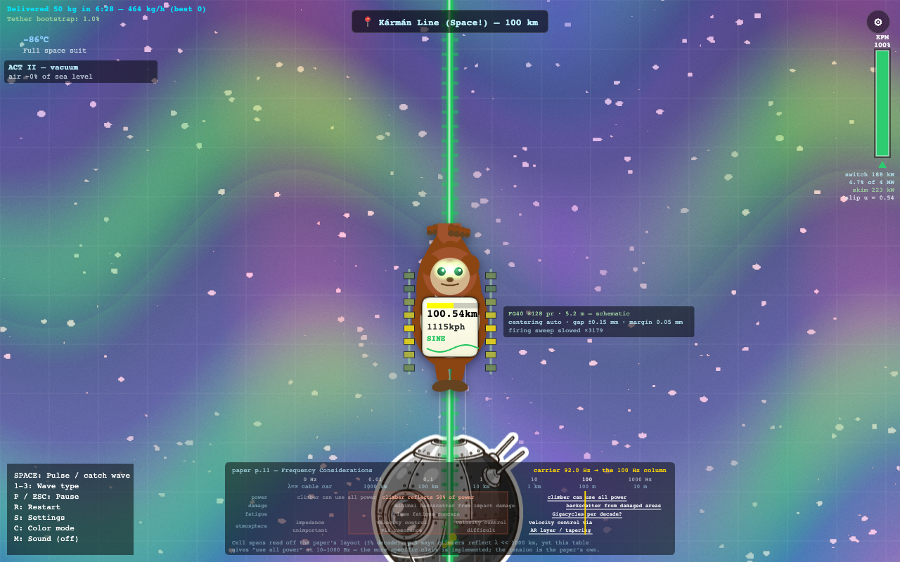
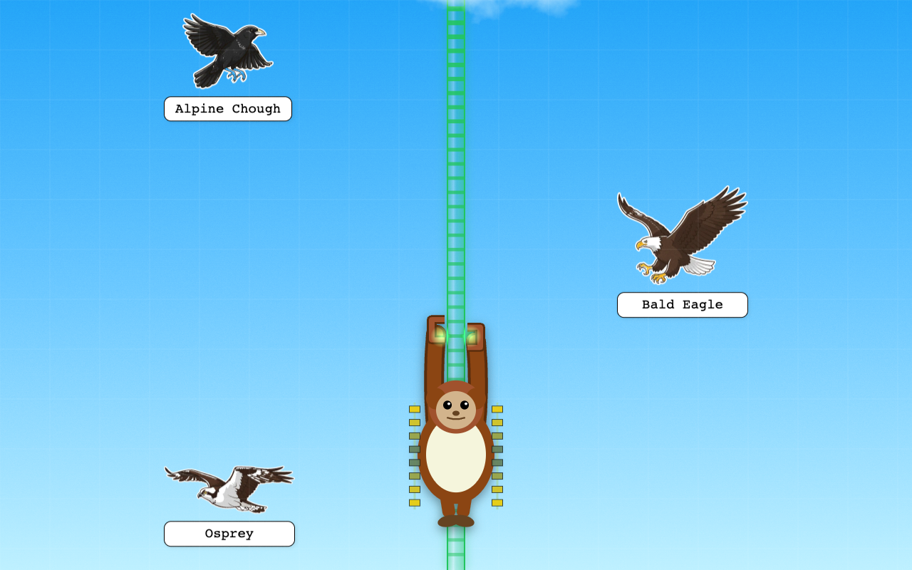

# Space Monkey Elevator 🚀🐵

A monkey rides waves up a ribbon to the edge of space. Hold `SPACE` to climb, let go before your
magnets brown out, and see how fast you can get 50 kg to the Kármán line.

**[Play it in your browser](https://atominnovationth.github.io/SMX/).** One key, no install.



<sub>Under the cartoon it is a real simulation of [published research](#the-paper) on powering space
elevator climbers with mechanical waves.</sub>

## The paper

**Blaise Gassend**, *Powering Climbers Using Mechanical Waves: Fundamental Limits, Getting Around
Them, and One Climber Concept*. ISDC 2025, Space Elevator Technical Session, Orlando, 21 June 2025.

Read it from the author: <https://gassend.net/spaceelevator/isdc2025/>, the link printed on his own
slides. If that host is slow, ISEC mirrors it
[here](https://www.isec.org/s/ISDC2025-05-Powering-Climbers-Using-Mechanical-Waves.pdf).

Every idea in this game comes from that deck. We are not affiliated with Dr. Gassend and he has not
endorsed this. Turning his figures into code was our own work, so any errors in it are ours, and
the code flags every number that is an estimate rather than something he published.

Also cited by the paper, and used here:

* **Mark A. Wessels**, [arXiv:1802.07443](https://arxiv.org/abs/1802.07443), patent US 8,196,867 B1.
  His 92 Hz carrier and 60 cm stroke are one of the presets.
* **Keith Lofstrom**, [Acoustic Wave Powered Climbers](http://www.launchloop.com/AcousticClimber).
  100-1000 Hz, 1.2-18 cm strokes, and the observation that descending climbers dump energy into
  ribbon vibrations.
* **Zubax [FluxGrip FG40](https://fluxgrip.zubax.com/)**, the real electro-permanent magnet hardware, including its
  published force-versus-airgap curve. No affiliation.

Full citations and art provenance: [`ATTRIBUTIONS.md`](ATTRIBUTIONS.md).

## What's real and what isn't

Exact, because you make decisions with them:

* `v_max = budget · strength / √(Eρ)`, which depends on the material alone, so a hotter carrier
  buys you no speed
* `A_max = v_max / ω`, `c = √(E/ρ)` ≈ 20.9 km/s, `λ = c/f`
* mean thrust from the closed-form slip integral, with slip `u = v_climber / v_film`
* switching power `4·N·E_switch·f`, extraction `F̄ · v`, and US Standard Atmosphere density

The impedance and power table on the paper's slide 6 reproduces to 2-3 significant figures, and
only at his ρ = 2300 kg/m³. It ships as a regression test.

Simplified on purpose, and labelled on screen: the reflection band, the stack's firing animation
(slowed down, and frozen if you prefer reduced motion), the monkey and the drawn magnet stack (not
to scale), and the ripple a passing descender leaves in the film.

Missing rather than faked: taper, drag on the wave itself, resonance tuning, powering more than one
climber, mode conversion, and heat.

Estimated rather than published, and flagged in the code: per-pair traction, gap flux, structure
mass, air drag, battery size.

## The default climb

100 GPa graphene, 92 Hz, 1 m stroke, 30% stress budget, 9 mm² film, 0.15 mm gap, 128 magnet pairs,
50 kg cargo.

That gets you 100 km in 6:28, averaging 929 km/h and cruising at 1115 km/h. Cruise is 49% of
`v_max`, which is an asymptote here, not a speed limit. Switching costs 188 kW, or 4.7% of the
paper's 4 MW budget.

92 Hz is a result, not a preference. Switching power rises with frequency while extraction stays
capped by `v_max`, so this film stalls above roughly 200 Hz. The slider still reaches 1000 Hz
because finding that wall is the point.

## Playing

Hold `SPACE` to catch the wave. Thrust fades as you catch up to it, and the magnets cost power the
whole time, so you grab, climb, let go, coast, and grab again.

| Key | Action |
|---|---|
| `SPACE` | Engage the magnets (hold) |
| `1` `2` `3` | Sine, square or sawtooth carrier |
| `S` | Settings: ground station, film, climber |
| `R` `P` | Restart, pause |
| `C` `M` | Colourblind palette, sound |



Presets, each checked against the simulation before shipping: paper baseline (6:28), Wessels
92 Hz and 60 cm (12:29), Lofstrom 1000 Hz (stalls on 2 MW of switching, which is the lesson), max
speed (4:53 at 1447 km/h), max payload (200 kg in 8:15).

Short callouts along the way each explain one page of the paper: down low a transverse wave would
cap out at 45 km/h, by 20 km the stress budget is your ceiling, at 40 km the air quits, descending
climbers pass at 30 and 60 km, and at 85 km a second climber asks for power, which the paper leaves
unsolved.

Stalling costs time and tells you why. It never ends the run. The run ends on a report card that
puts your speed, switching loss, stroke and carrier next to the paper's own figures. Score is
throughput: kilograms to the Kármán line per hour.

Nothing flashes above 3 Hz, `prefers-reduced-motion` is honoured, and an Okabe-Ito palette keeps
colour from being the only signal. It needs a keyboard, so phones get a notice instead of the game.
That's the next thing to fix.

## Run and build

```bash
node --test tests/*.test.mjs   # 105 tests, no dependencies
bash tools/check.sh            # tests, rebuild check, asset check, browser smoke
python3 embed_assets.py        # Space_Monkey_Elevator.html -> index.html
```

Edit `Space_Monkey_Elevator.html`. `index.html` is generated, so rebuild and commit both. It loads
sprites from `assets/`, so those have to be served alongside it. Contributor notes are in
[`docs/DEVELOPERS.md`](docs/DEVELOPERS.md). Skip `docs/v1.0-roadmap.md`, its physics is out of date.

## Credits and licence

Physics: Gassend, Wessels, Lofstrom. Hardware: Zubax. Built with plain JavaScript, Canvas 2D and
one WebGL shader.

Climbing past real landmarks toward the Kármán line is a tribute to
["Space Elevator" by Neal Agarwal](https://neal.fun/space-elevator/), which remains © Neal Agarwal.
All code and art here is original.

The paper itself is not redistributed here. It carries no redistribution grant, so the game links to
the author's copy.

[MIT](LICENSE), code and art alike.

Still in progress, so the live build moves around. Taper, wave drag, resonance, multi-climber
support and touch controls are next. Issues and pull requests welcome:
[CONTRIBUTING.md](.github/CONTRIBUTING.md).
