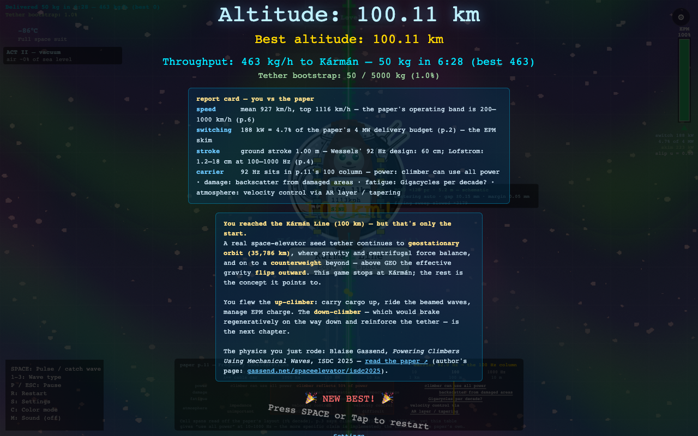

# Space Monkey Elevator 🚀🐵

**A playable illustration of Blaise Gassend's
[*Powering Climbers Using Mechanical Waves*](https://www.isec.org/s/ISDC2025-05-Powering-Climbers-Using-Mechanical-Waves.pdf)
(ISDC 2025).**
The physics is his. The monkey is ours.

**Play it:** [atominnovationth.github.io/SMX](https://atominnovationth.github.io/SMX/)


A ground station beams **longitudinal (compression) waves** up a graphene seed ribbon. You ride
them to the Kármán line on a stack of **electro-permanent magnets** that pulse to induce eddy
currents in the moving film — **nothing ever touches**. Hold `SPACE` to engage the stack: the
onboard controller gates each cycle so it only pulls while the film is outrunning you, thrust
fades as your speed closes on the wave, and the switching energy has to come back out of the
power you skim. Your job is the supervisory one — carrier, stress budget, air gap, magnet pairs,
cargo — and knowing when to let go.

It is a game so that people will actually play it. Everything the player *reasons with* is the
paper's own arithmetic.

---

## The work this exists to point at

The concept is **not ours**, and the reason this repository exists is to make it legible to
people who have never heard of it.

> ### Blaise Gassend
> **_Powering Climbers Using Mechanical Waves: Fundamental Limits, Getting Around Them, and One
> Climber Concept_** — presented at the National Space Society's **International Space
> Development Conference (ISDC) 2025**, Space Elevator Technical Session, Orlando FL,
> 21 June 2025.
>
> **Read it from the author:** <https://gassend.net/spaceelevator/isdc2025/> — the link printed on
> his own slides, and where traffic belongs. A verified mirror, if that host is slow to answer:
> [ISEC](https://www.isec.org/s/ISDC2025-05-Powering-Climbers-Using-Mechanical-Waves.pdf)
> (item 05 on [ISEC's publications page](https://www.isec.org/recent-publications), which also has
> an animated version and the presentation video).
>
> Every idea this simulation is *about* comes from that deck: powering a space-elevator climber
> with mechanical waves in the ribbon instead of lasers or cables, and the impedance, frequency,
> stroke, drag, taper, resonance and reflection trade-offs that follow. The slides are dense and
> quantitative, which is exactly why they can be simulated rather than merely illustrated.

**We are not affiliated with Dr. Gassend, and nothing here is endorsed by him.** Deriving the
game's constants from his figures is our own work and may contain our own mistakes — where a
number is an estimate rather than a published figure, the code says so beside the constant.
Corrections are welcome, and the paper's own open questions are surfaced in-game rather than
quietly answered.

### Prior art the paper cites, and the hardware

- **Mark A. Wessels** — *Space Elevator Propulsion with Mechanical Waves*,
  [arXiv:1802.07443](https://arxiv.org/abs/1802.07443) (2018); patent **US 8,196,867 B1**.
  His 92 Hz carrier and 60 cm stroke are two of the game's reference points and one of its presets.
  *(Gassend's slide 4 cites a different patent number; [`ATTRIBUTIONS.md`](ATTRIBUTIONS.md)
  records the discrepancy as a note rather than silently propagating or "fixing" it.)*
- **Keith Lofstrom** — *Acoustic Wave Powered Climbers* ([wiki](http://www.launchloop.com/AcousticClimber)):
  100–1000 Hz, 2–6 MW, 25–250 m wavelengths, 1.2–18 cm displacements — the low end of the game's
  stroke range, a second preset, and the source of the observation that **descending climbers
  dissipate energy into ribbon vibrations** (which is why the descenders you meet visibly disturb
  the film).
- **Zubax Robotics [FluxGrip FG40](https://fluxgrip.zubax.com/)** — the real electro-permanent-magnet
  hardware the coupling stack is modelled on, including its published force-versus-airgap curve.
  No affiliation or endorsement implied.

Full citations, per-file art provenance, and which numbers are published versus estimated:
[`ATTRIBUTIONS.md`](ATTRIBUTIONS.md).

---

## What is exact, what is summarised, what is not modelled

The rule the project is built on: **be exact where the player reasons, summarise visibly where
they only watch, and never invent.** Invented mechanics were deleted rather than tuned — the
altitude-attenuating wave, the magnet-material ladder and the pulse-timing minigame are all gone.

**Exact — the relations you manipulate:**

| Quantity | In the sim |
|---|---|
| Speed ceiling | `v_max = budget · strength / √(Eρ)` — material-only, independent of carrier and amplitude, so raising frequency cannot buy speed |
| Stroke budget | `A_max = v_max / ω` — the ground station's stroke, and why a high carrier is *buildable* |
| Wave speed / wavelength | `c = √(E/ρ)` ≈ 20.9 km/s; `λ = c/f` (227 m at the shipped 92 Hz) |
| Mean thrust | the closed-form slip integral `F̄ = (kV/2π)·[2√(1−u²) − u(π − 2·arcsin u)]`, `u = v_climber/V` — exact to machine precision for a sine carrier, no sub-stepping, no 60 fps aliasing |
| Switching cost | `4·N·E_switch·f` — flat in duty cycle (two transitions per cycle per unit, two units per pair, ~4 J each) |
| Extraction | `F̄ · v_climber`, the mechanical power actually skimmed |
| Air density | US Standard Atmosphere, the same table the act break reads |
| Impedance / power | `Z/A = cρ`, `P/A = σ²/(cρ)` |

Those last two are also a **regression test**. The paper's slide 6 publishes impedance and power
figures; the sim reproduces **every one to 2–3 significant figures** — 48 and 14 N/(m/s)/mm²,
150 kW/mm² at 200 km/h, 3.7 MW/mm² at 1000 km/h, 42 MW/mm² at 45 GPa, c = 21 and 6.3 km/s — and
only at the paper's own **ρ = 2300 kg/m³**. The project had been using 1800, which misses all of
them by 8–13 %; deferring to the source fixed the whole units chain, so slide 6 is now a committed
fixture in [`tests/pure.test.mjs`](tests/pure.test.mjs).

**Summarised, and labelled as such:** the reflection band is a shaded zone, not a boundary-value
solve; the stack's firing sequence is a deliberately slowed schematic (never above 3 flashes/s,
frozen under `prefers-reduced-motion`); the monkey and the drawn magnet stack are **not to scale**
and say so on screen; the ripple a passing descender leaves in the film is schematic and never
enters the thrust integral.

**Not modelled — deferred, not faked.** These are marked absent in-game rather than approximated:
tether **taper** (p.9), quadratic drag on the **wave itself** (p.7), **standing-wave resonance**
and its retuning (p.10), **powering more than one climber** (p.14 — the game raises it as the open
question it is, and offers no invented share/refuse mechanic), mode conversion above the
atmosphere (p.12), and the *hot* side of thermal (FG40's 73 °C limit, the loss of convection —
the cold side, with suits and a capped cold-coupling penalty, is in). The paper's own wave equation
likewise ignores gravity/centrifugal gradients and longitudinal-transverse coupling.

**Flagged estimates** (all documented at the constant): the per-pair traction coefficient
`k ≈ 0.043 N/(m/s)` and the working-gap flux, both derived from FG40's holding force and pole
geometry; the gap→flux mapping, which reuses the *shape* of a curve measured for **static contact
holding of iron** — a defensible approximation for a contactless eddy-current gap, not a
measurement; the 25 % structure-mass fraction; and two openly documented gameplay tunes (linear
air drag, battery capacity).

---

## What the model produces on its own

Defaults: 100 GPa polycrystalline graphene, **92 Hz** carrier, 1.00 m stroke, 30 % stress budget
(= 9 % of stress-limited power — the paper's "10 % at 1000 km/h", reconciled on screen), a
45 mm × 0.2 mm = 9 mm² film at 100 kgf, 0.15 mm air gap, **128 opposed FG40 pairs** (256 units,
5.2 m, 23 kg dry), 50 kg cargo, 1.00 G.

From those, without being told to:

- **100 km in 6 min 28 s**, mean **929 km/h**, cruising at **1115 km/h** — the paper's ~1000 km/h
  operating point **emerges** instead of being asserted (the test pins it as a band, not a number).
- Cruise settles at **0.49 × v_max** (2252 km/h). `v_max` is an **asymptote**: there is no speed
  clamp anywhere in the code, and a test proves thrust fades to zero only in the limit.
- **188 kW of switching = 4.7 % of the paper's 4 MW** delivery budget, inside its "<10 % skim".
- The engage/release **rhythm is emergent**: extraction collapses as slip closes while switching
  stays flat, so a hot carrier forces brownouts in the 2–8 s band — nobody scripted that.
- **92 Hz is a finding, not a preference.** Switching watts grow with `f` while extraction is
  capped by `v_max`, so this film class stalls above ~200 Hz. The slider still spans 92–1000 Hz
  **because that wall is the paper's story** — and one preset walks you straight into it.

---

## Playing it

| Key | Action |
|---|---|
| `Space` | Engage the EPM stack (hold; thrust fades as your speed closes on the wave) |
| `1` / `2` / `3` | Carrier shape — sine / band-limited square / band-limited sawtooth (the paper's ratchet climber) |
| `S` / ⚙ | Settings: **Ground station**, **Film**, **Climber** — each with its derived readouts |
| `R` | Restart · `P` / `Esc` pause |
| `C` | Okabe-Ito colorblind palette · `M` sound (starts muted) |

**Presets**, for anyone arriving from the talk rather than from a slider wall — each validated
against the balance harness before shipping:

| Preset | What it is |
|---|---|
| Paper baseline | The reference climb above (6 min 28 s) |
| Wessels 92 Hz · 60 cm | His own operating point — 350 m/s ribbon speed, 12 min 29 s climb |
| Lofstrom 1000 Hz | His band's top end — and **~2 MW of switching against a 4 MW budget: it stalls.** The wall, labelled |
| Max speed | 130 GPa, 60 % budget, 192 pairs — 4 min 53 s, 1447 km/h |
| Max payload | 200 kg to Kármán, 256 pairs, tighter gap — 8 min 15 s |

**The climb has beats, each teaching one page:** at ~12 km a transverse wave would already be
capped at 45 km/h and 20 kW (p.7) — you cross that altitude at about **670 km/h**, fifteen times
the transverse limit, and the card prints your live speed to make the point; at ~20 km the stress
budget becomes your ceiling; **40 km is the vacuum threshold** and the run's biggest moment; at ~30
and ~60 km a **descending climber blurs past** (p.5) and dumps energy into the ribbon behind it; at
~70 km gigacycle fatigue, but only if your carrier sits in the paper's top decade; at ~85 km a
second climber asks for power and the honest answer is *unsolved* (p.14).

**Failure is soft.** A stall costs time and explains itself in words — slip collapsed near the
asymptote, or the stack is simply overloaded — and never ends the run.

**The run closes on a report card against the paper's own figures:** your speed against its
200–1000 km/h band, your switching loss against 4 MW, your stroke against Wessels' 60 cm and
Lofstrom's 1.2–18 cm, and your carrier's cell in the p.11 table. The score is **throughput —
kilograms to the Kármán line per hour** — because that is the figure of merit that subsumes both
maximum load and maximum speed.



**Accessibility:** no flashing above 3 Hz anywhere (WCAG 2.3.1), `prefers-reduced-motion` honoured
(shake, bursts and the firing sweep freeze), an Okabe-Ito palette so coupling state is never
colour-only, and plated HUD text that survives the bright low sky. **Known limitation:** it needs a
keyboard, so phones currently get a notice instead of the game — a real gap for a conference
audience, and the next thing worth fixing.

---

## Verify it yourself

```bash
node --test tests/*.test.mjs   # 105 unit tests, zero dependencies
bash tools/check.sh            # tests + rebuild check + asset refs + browser smoke
```

The tests are the argument, not decoration: the **slide-6 fixture** proves the units chain against
published numbers; the **balance harness** drives the real integrator and commits a trace snapshot,
so a retune and a regression can never be confused (it also asserts frame-rate independence at
1/60 vs 1/240, and that terminal speed stays strictly below `v_max`); the assertions pin that the
wave travels **up**, that `v_max` is independent of carrier and amplitude, and that the slip
integral matches its closed form at `u = 0, ¼, ½, ¾ → 1` with no clamp. Eighteen browser smoke
checks cover the render layer, including the 3 Hz flash ceiling and the reduced-motion freeze.

---

## Building from source

Two HTML files live at the root:

- [`Space_Monkey_Elevator.html`](Space_Monkey_Elevator.html) — **the editable source**. References
  assets in [`assets/`](assets).
- [`index.html`](index.html) — **committed build artifact**, generated (never hand-edited). Static
  assets are inlined as base64; the 78 landmark sprites load at runtime from [`assets/`](assets), so
  `index.html` must be served alongside that folder. It is not a standalone offline file.

```bash
python3 embed_assets.py   # source -> index.html; commit BOTH files
```

```
.
├── index.html                   # the game (served by Pages, alongside assets/)
├── Space_Monkey_Elevator.html   # editable source — this is what you edit
├── assets/                      # runtime sprites and textures
├── embed_assets.py              # build script
├── tests/                       # unit tests, balance harness, browser smoke
├── tools/                       # check.sh gate, check_refs.py
├── docs/                        # DEVELOPERS, CHANGELOG, setup, archived planning
├── screenshots/                 # README imagery
├── ATTRIBUTIONS.md              # ideas first, then art, then licence position
└── LICENSE                      # MIT
```

Developer notes — the model, the invariants, and the rituals that keep the tests honest — are in
[`docs/DEVELOPERS.md`](docs/DEVELOPERS.md). (`docs/v1.0-roadmap.md` is pre-rewrite history and
contains superseded physics; do not read it as current.)

---

## Credits

- **Physics and prior art:** Blaise Gassend, Mark A. Wessels, Keith Lofstrom; hardware by Zubax
  Robotics. See above and [`ATTRIBUTIONS.md`](ATTRIBUTIONS.md).
- **Technologies:** vanilla JavaScript, Canvas 2D, a WebGL atmosphere shader. No frameworks, no
  build step beyond one Python script, and no dependencies in the unit tests (the optional browser
  smoke test uses `playwright-core` if it is installed, and skips itself if not).
- **Inspiration for the *shape* of the experience:** ["Space Elevator" by Neal Agarwal](https://neal.fun/space-elevator/)
  — climbing past real landmarks toward the Kármán line is a tribute to that page. All code and
  artwork here are original. What this repository can prove: no `.js`, `.css` or GLSL from neal.fun
  was ever tracked here, and all 10 WebGL sky textures are original procedural work generated
  in-repo. The sky's *layer structure* parallels the reference page and the GLSL has not been
  line-by-line audited against it — [`ATTRIBUTIONS.md`](ATTRIBUTIONS.md) discloses that rather than
  claiming more than the evidence shows. The original *Space Elevator* concept and artwork remain
  **© Neal Agarwal**.

> ✅ **Artwork status — resolved at v1.0 (2026-08-03).** All imagery in [`assets/`](assets) is
> original to this project — AI-generated from tracked hand-written prompts, or drawn procedurally —
> and is covered by this repo's MIT licence. Earlier revisions bundled third-party art
> (© Neal Agarwal); that art was removed and the history containing it was rewritten out of the
> repository on 2026-08-03.

> 📜 **History note.** On 2026-08-03 the git history was rewritten and the GitHub repository was
> recreated. Clones, forks and commit SHAs from before that date are incompatible — please re-clone.

> 📄 **On the paper itself:** the slides are **not** redistributed here, deliberately. They carry no
> redistribution grant, so the game links to the author's own copy instead — see
> [`ATTRIBUTIONS.md`](ATTRIBUTIONS.md).

---

## License

[MIT](LICENSE) — covering the **whole repository, code and art alike**; for AI-generated images the
grant operates to the extent any rights exist. Per-file provenance: [`ATTRIBUTIONS.md`](ATTRIBUTIONS.md).

---

> ℹ️ **Status: under active development, and honest about it.** The coupling model, the readouts and
> the climb's structure are being reworked to follow the source faithfully, so the published build is
> a moving target. The deferred physics above (taper, wave drag, resonance, multi-climber) is the
> next milestone, along with touch support. Issues and PRs welcome — see
> [CONTRIBUTING.md](.github/CONTRIBUTING.md).
